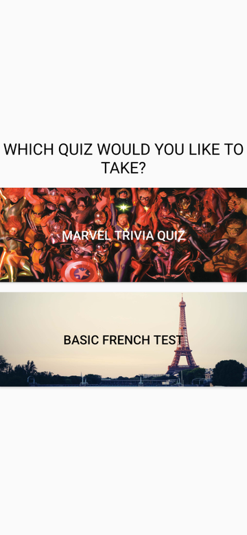
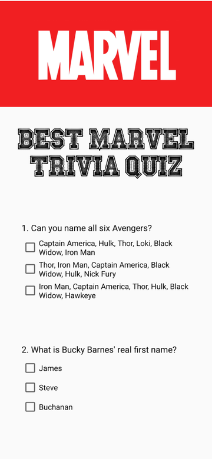
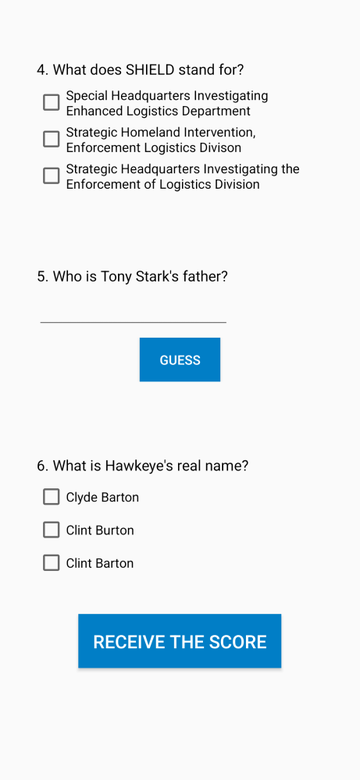
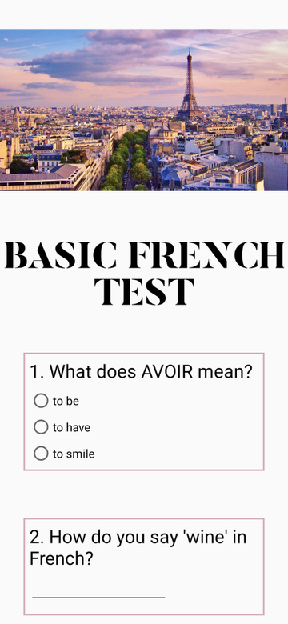
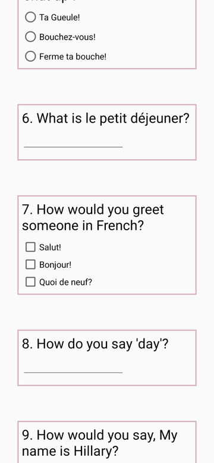

# Quiz App

> **Original version:** this README and some fixes were added in 2026. To see the project exactly as it was first built, browse commit [`f06cdb0`](https://github.com/dianapaula19/quiz-app/tree/f06cdb01d4b014eca30188f1963fdce5c9a5a977) (2020-08-06).

An Android app with two quizzes: a **Marvel trivia quiz** with animated GIF questions and a
**basic French test**. Answers are highlighted as right or wrong, and the final score comes
with a message that depends on how well you did.

My third project for the *Google Developer Challenge Scholarship* (Android Basics, Udacity,
January 2018).

- Java, custom fonts and drawable borders for right/wrong answers
- Radio buttons, checkboxes and free-text answers across the two quizzes

## Screenshots

  
  
  
  
  

Rendered in 2026 from the app's own layouts with [Paparazzi](https://github.com/cashapp/paparazzi).
After each Marvel answer the app shows whether it was right, plus an animated GIF; those GIFs are
clips of an actor, so they are not shown here.

Open the project in Android Studio and run it on an emulator or a phone.
